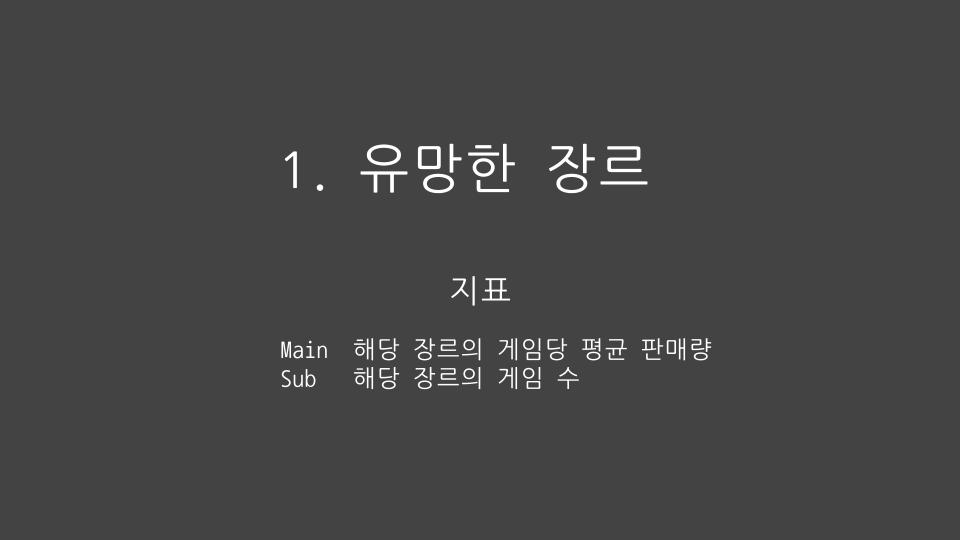

# Codestates Project 1

## 문제
- 다음 분기에 어떤 게임을 설계해야 할까?

 

## 접근 방법
- 게임 판매 데이터를 이용한 트렌드 분석을 통해 의사결정

 

## 참고 사항
- 회사 이름을 제외한 결측치가 있는 경우는 분석시 해당 행 무시
   
- 게임업계는 변화가 빠르기에 분석에는 2010~2016년 데이터를 주로 사용
   
- 2017년 이후 데이터는 수가 너무 적어 분석 시 무시

- 현재는 2018년 정도라고 가정하였음. 2022년 기준 분석을 하려면 2017~2021년 데이터가 보강되어야 함

 

## 결론
- PS4 기반의 Shooter 게임을 출시하여 미국, 유럽 지역에 집중적으로 홍보

 

## 분석 과정 및 설명
우리가 고려해야 할 사항은 크게 3가지입니다.
게임의 장르, 플랫폼, 그리고 지역이죠.

저는 먼저 유망한 장르를 고르고, 플랫폼을 고른 다음 둘의 궁합이 잘 맞는지 확인했습니다.
그리고 나서 집중적으로 홍보할 지역을 선정했습니다.
다음과 같은 네 단계를 거친 것이죠.

 

### 1. 유망한 장르 분석
 

저는 평균적으로 잘 팔리면서 시장 크기가 너무 작지는 않은 장르를 고르고 싶었습니다.

따라서 게임당 평균 판매량을 주 지표로 삼고 게임 수를 보조 지표로 삼았습니다.

 

다음 그래프는 2010년 이후의 게임당 평균 판매량을 나타낸 것입니다.
전체 장르를 다 표시하진 않았구요, 장르 중 게임당 판매량 수치가 높은 5개만을 뽑아서 그렸습니다.

그래프를 보면 Shooter 장르의 지표가 압도적이죠.
따라서 Shooter 장르의 게임 수만 충분하다면 이 장르를 가장 유망한 장르로 판단할 수 있습니다.

이를 확인하기 위해 다음 그래프를 살펴보겠습니다.
이 그래프는 장르별 게임 수 비율을 나타낸 것으로 보라색으로 표현된 Shooter 장르가 전체의 10% 남짓을 차지하고 있습니다.

전체 장르가 12개이므로 10% 정도라면 충분한 수치라고 생각되어 Shooter 를 가장 유망한 장르로 판단했습니다.

하지만 그 전에 최종 심판대를 한 번 거쳐갔는데요.

최종 심판대는 평균의 함정을 피해가기 위한 것으로, 만약 Shooter 장르의 판매량이 상위 몇 게임에만 몰려있다면 우리가 출시하는 게임이 잘 팔릴 확률은 희박합니다.

따라서 Violin Plot 을 그려서 Shooter 장르의 판매량 분포를 확인해보도록 하겠습니다.
마찬가지로 2010년 이후 데이터만 사용했습니다.

이것이 Shooter 장르 판매량의 Violin Plot 인데요 분포가 아래쪽으로 쏠려 있습니다.

아무래도 몇몇 게임에 판매량이 대부분 몰려있는 것 같습니다.

이대로 평균의 함정에 빠지게 되는걸까요?

그러나 다른 장르들의 Violin Plot 또한 그려보면 Shooter 장르가 그렇게 심한 것은 아니라는 사실을 발견하게 됩니다.

이것이 다른 장르들의 판매량 Violin Plot 입니다.

Shooter 장르만큼이나 아래쪽으로 납작한 모습을 볼 수 있죠.

몇몇 장르는 심지어 더 납작해보이기도 합니다.
물론 y축의 단위를 고려해서 봐야겠지만요.

 

결론적으로는 게임 업계 자체가 승자독식인 것이지요.

그런데 놀라운 사실은 Shooter 장르는 장르별 판매량 순위가 최고가 아님에도 불구하고 판매량의 중간값은 전 장르를 통틀어 1등입니다.

1등이 아닌 게임도 많이 팔릴 가능성이 가장 높은 것이죠.

이 정도면 최종심판대를 통과할 자격이 있다고 생각됩니다.

따라서 저는 Shooter가 가장 유망한 장르라고 판단했습니다.

 

추가적으로 판단에 중요한 영향을 미치진 않았지만 재미있는 데이터가 있어 소개합니다.
바로 2010년 이후 판매량 상위 100개, 하위 1000개 게임의 장르 분포인데요,
왼쪽이 상위 100개, 오른쪽이 하위 1000개를 표현한 그래프입니다.

왼쪽에서는 차지하는 비율이 높을수록, 오른쪽에서는 낮을 수록 좋은 것이겠죠.

Shooter 장르는 여기서도 아주 좋은 지표를 기록합니다.

왼쪽에서는 2등, 오른쪽에서는 뒤에서 4등을 기록하고 있죠.

이제 장르 분석을 마무리하고 유망한 플랫폼 분석으로 넘어가보겠습니다.

 

### 2. 유망한 플랫폼 분석
 

플랫폼에 대한 지표로는 플랫폼별 총 판매량을 사용했습니다.

여기서는 플랫폼별 게임 당 평균 판매량을 사용하지 않았는데요

그 이유는 플랫폼 선택에서 가장 중요한 것은 그 _플랫폼의 기기를 사용자들이 얼마나 많이 갖고 있는지_ 이며 이를 가장 충실히 반영해주는 것은 게임당 평균 판매량이 아닌 _총 판매량_ 이라고 생각했기 때문입니다.

 

이 그래프는 플랫폼별 총 판매량을 나타낸 것인데요, 날이 갈수록 판매량이 급감하는 모습을 볼 수 있습니다.

콘솔 게임이 하락세라고 하던데 그 말이 사실인가 보네요.

우리가 궁금한 것은 플랫폼별 판매량 비율이므로 총합을 1로 맞춰주겠습니다.

게임기기는 신제품 출시 주기가 워낙 짧기에 그래프를 보면 최근 몇 년 사이에도 점유율이 급변한 것을 볼 수 있죠.

최근에는 PS4, XOne 이 떠오르고 있네요.

그 중에서도 PS4의 지표가 더 좋으므로 유망한 플랫폼으로는 PS4를 선정했습니다.

 

여기서도 재미로 2010년 이후 판매량 상위 100, 하위 1000의 플랫폼 분포 데이터를 살펴보면
PS4는 왼쪽에서는 3위, 오른쪽에서는 뒤에서 4위를 기록함을 알 수 있습니다.

 

### 3. 장르와 플랫폼 궁합 분석

다음으로는 Shooter 장르와 PS4의 궁합을 살펴볼텐데요.

이를 위해 Shooter 장르의 플랫폼별 판매량과 전체 장르의 플랫폼별 판매량을 비교해보겠습니다.

Shooter 장르일 때 PS4 점유율이 전체 장르일 때보다 높다면 Shooter 와 PS4 는 궁합이 잘 맞는 것이겠죠.

 

그래프를 보면 전체 장르(오른쪽)일 때보다 Shooter 장르(왼쪽)일 때 PS4의 점유율이 더 높은 것을 볼 수 있습니다.

즉, Shooter 장르와 PS4는 찰떡궁합인 셈입니다.

이 정도면 Shooter 장르의 PS4 기반 게임을 출시하자고 결정할 수 있겠죠.

 
 

### 4. 홍보 지역 결정

장르와 플랫폼을 선정했으니 이제는 집중 홍보할 지역을 결정해보겠습니다.

여기서는 해당 지역의 Shooter 장르이며 PS4 기반인 게임 판매량을 지표로 삼았습니다.

 

이 그래프는 2010년 이후 Shooter 장르의 PS4 기반 게임의 지역별 판매량을 나타낸 것입니다.

미국, 유럽은 25000K, 즉 2500만을 넘는 판매 수치를 기록하고 있는 반면 일본과 다른 지역에서는 판매량이 그렇게 높지는 않습니다. 시장 규모가 꽤 큰 차이를 보이죠.

따라서 미국과 유럽 지역 위주로 홍보하는 것이 좋은 홍보 전략이라고 생각됩니다.

 

홍보 지역까지 결정했으니 이제 결론을 내릴 수 있겠죠.

저는 PS4 용 Shooter 게임을 만들고 미국, 유럽 지역에 홍보할 것을 제안드립니다.
이것이 리스크는 최소화하며 리턴은 최대화하는 전략이라고 생각됩니다.

 

### 추신

그리고 이와 별개로 판매 수익으로만 돈을 버는 게임이 하락세인 것을 고려해볼 때 모바일 가챠게임을 만드는 것은 어떨지 조심스럽게 제안을 드립니다.
최근에 정말 많이 떠오르고 있죠.

